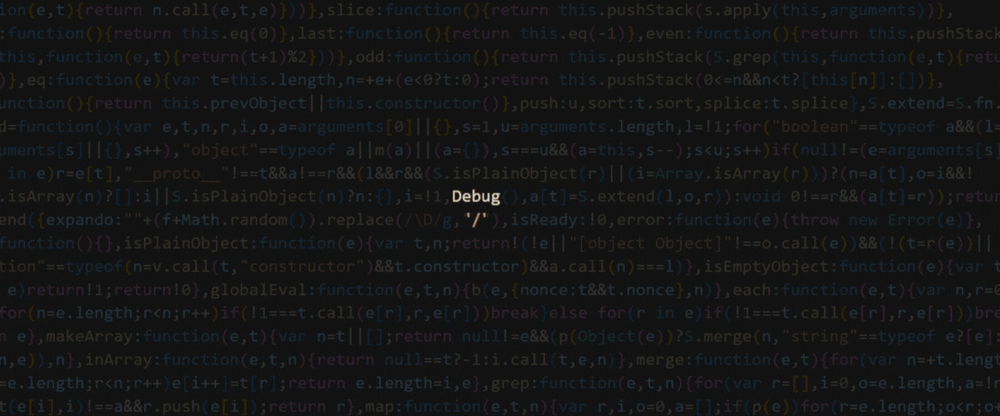

<!--  -->

  

Hola a todo/as, mi nombre es Santiago Caballero, soy de Buenos Aires, Argentina.
Me encuentro en búsqueda de mi primer oportunidad laboral en el mercado tech, mis
estudios fueron realizados en el BootCamp de SoyHenry. 

### Tecnologías: Javascript, React, Redux, Node, Express, postgreSQL, HTML, CSS.

  

Mi contacto:
  

  

Mail: saantyc12.caballero@gmail.com
  

  

Portfolio: https://portfolio-sc.vercel.app/
     

 

