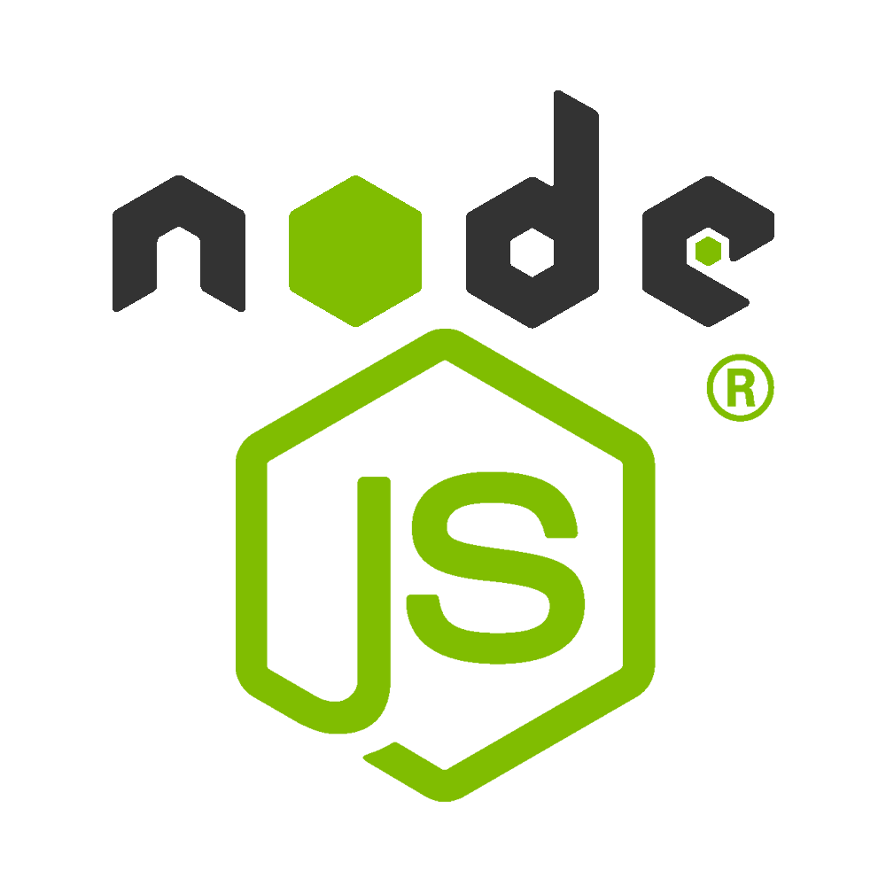
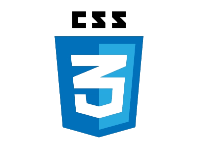

<!--  -->

  

 👋​Hola a todo/as, mi nombre es Santiago Caballero, de Buenos Aires, Argentina, y Full Stack Developer🧑‍💻. Me considero una persona autodidacta, resiliente, competitiva,  y con mucha actitud positiva. Tengo muchas ganas de aprender, y crecer.
 

🤖Tecnologías: 

  

Mi contacto:
  

  

📩​Mail: saantyc12.caballero@gmail.com
  

  

💻​Portfolio: https://portfolio-sc.vercel.app/
     

 

